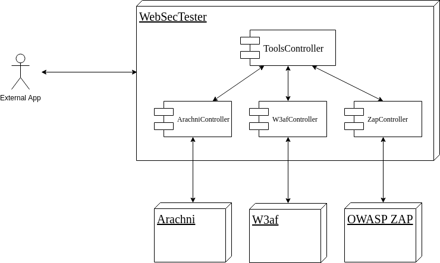

# WebSecTester    

## REST service for unification of web vulnerability analysis tools

### Index

1. [Project description](#project-description)
2. [Features](#features)
3. [Architecture](#architecture)
4. [How to run](#how-to-run)
5. [Basic usage](#basic-usage)
6. [How to build](#how-to-build)
7. [Development documentation](#development-documentation)

## Project description
This project consists of a management system for web application security analysis tools.

The system integrates the management of the different tools and offers a common REST API to ease launching, controlling and getting the results of the security analysis of a web application, in a unified way and regardless of the selected tool.

WebSecTester is ready to be distributed in a Docker container image, with the aim of making easier its integration in a continuous integration system, and periodically performing security analysis on web applications within the software development cycle.

## Features

WebSecTester provides a REST service to which requests can be sent to initiate and control vulnerability analysis tasks on target web applications, in a unified way and independently of the specific tool selected.

Once the analysis is started, there are also requests to obtain the current status of the task, control its execution (pause, continue), and to obtain the result with the analysis report in a homogeneous way among the different tools.

Currently, the web security analysis tools managed by WebSecTester are the following:

+ **OWASP ZAP**: Zed Attack Proxy  
https://www.owasp.org/index.php/OWASP_Zed_Attack_Proxy_Project

+ **Arachni**: Web Application Security Scanner Framework  
http://www.arachni-scanner.com/

+ **W3af**: Web Application Attack and Audit Framework  
http://w3af.org/

## Architecture

## How to run

You can use the docker container image ready to use from DockerHub. You must have docker installed on your system. Simply run the following command and automatically WebSecTester will start after a few moments:

    sudo docker run -p 8080:8080 jcascan/websectester

This command downloads the container image, runs the container and starts the WebSecTester REST service listening at port 8080 by default. If you want to start it in another port, just change the first number in the -p parameter.

## Basic usage
Once the application has started, you can start using it by sending it requests to perform security analysis to the target web application. In each request you must specify the tool (parameter `toolId`) you want to use. Note that the analysis task ID given by the new scan request corresponds only to the tool you used to start that task. The current tool identifiers are:

+ `zap`: OWASP ZAP
+ `arachni`: Arachni
+ `w3af`: W3af

### List of integrated tools

#### Request

    GET /tools

Headers:

    Accept: application/json
    
#### Response

List of integrated analysis tools, with their names, identifiers and current availability.

    [
        {
            "name": "OWASP ZAP",
            "identifier": "zap",
            "available": true
        },
        {
            "name": "Arachni",
            "identifier": "arachni",
            "available": true
        },
        {
            "name": "W3af",
            "identifier": "w3af",
            "available": false
        }
    ]

### Perform a new scan

#### Request

    POST /tools/{toolId}/scans

Headers:

    Accept: application/json
    Content-Type: application/json

Body:

    {
        "url": "http://testhtml5.vulnweb.com"
    }

If you want to send credentials to be authenticated in the application to make the tool analyze non-public sections, you must add a property in the body of the request that contains the following information:

+ Username.
+ Password.
+ Name of the HTML input of the user name in the login form.
+ Name of the HTML input of the password in the login form.
+ URL of the POST request that is sent when submitting the authentication form.
+ URL to verify that it has been authenticated, searching for a certain string.
+ String to look for in the body of the response of the authentication request, or in the previous URL, to know if the authentication has been successful.
+ String to be searched in the body of any response to find out if the tool has been disconnected (for example, by logout operation unintentionally during scanning).

For example, to authenticate in an instance of the vulnerable WebGoat application that is running at the address http://192.168.1.200:8080/WebGoat, with the user 'webgoat' and password 'goatpass', the following object can be sent JSON in the request:

    {
        "url": "http://192.168.1.200:8080/WebGoat",
        "auth": {
            "username": "webgoat",
            "password": "goatpass",
            "usernameField": "username",
            "passwordField": "password",
            "authUrl": "http://192.168.1.200:8080/WebGoat/login",
            "checkLoggedInUrl": "http://192.168.1.200:8080/WebGoat/start.mvc",
            "checkLoggedInString": "Logout",
            "checkLoggedOutString": "Register"
        }
    }

#### Response

Identifier of the analysis assigned by the selected tool.

    {
        "id": "<scanId>"
    }

### Monitor scan status

#### Request

    GET /tools/{toolId}/scans/{scanId}

Headers:

    Accept: application/json

#### Response

State of the analysis task. Depending on the selected tool, the progress of the analysis is included (it may be a percentage or a fraction of completed jobs).

    {
        "status": "[RUNNING | PAUSED | DONE …]",
        "progress": “45”
    }

### Manage scan tasks

#### Requests

##### Pause a scan

    PUT /tools/{toolId}/scans/{scanId}/pause

##### Resume a scan

    PUT /tools/{toolId}/scans/{scanId}/resume

Headers:

    Accept: application/json

#### Response

State of the analysis task, to know if there has been success pausing or resuming it.

### Retrieve a scan report

#### Request

    GET /tools/{toolId}/scans/{scanId}/report

Headers:

    Accept: application/json

#### Response

Report with the results of the analysis. It consists of a JSON object with the information of the analysis and the alert list of vulnerabilities found, whose structure will be prepared to hold all the information returned by the analysis tools. If any tool does not return a specific information element or the alert does not include it, simply the corresponding attribute will be sent empty or it will not be sent.

Report structure example:

    {
        "progress": “100”,
        "status": "DONE",
        "alerts": [
            {
                "name": "Cross Site Scripting (Reflejada)",
                "description": "Cross-site Scripting (XSS) is an attack ...",
                "url" : "http://testhtml5.vulnweb.com/reset",
                "severity": "High",
                "solution": "Phase: Architecture and Design\nUse a vetted library or...",
                "attack": {
                    "param": "signin",
                    "evidence": "\" onMouseOver=\"alert(1);",
                    "attributes": {
                        "cookie_keys": "['username']",
                        "cookie_object": "Set-Cookie: username=admin; Path=/",
                        "cookie_string": "username=admin; Path=/"
                    }
                },
                "references": [
                    {
                        "source": "CWE",
                        "id": "79",
                        "url": "http://cwe.mitre.org/data/definitions/79.html"
                    },
                    {
                        "source": "WASC",
                        "id": "8",
                        "url": "http://projects.webappsec.org/Cross-Site-Scripting"
                    }
                ]
            },
           ...
        ]
    }

## How to build

### Docker

    sudo docker build . -t websectester
    sudo docker run -p 8080:8080 websectester

The first command compiles the application and builds its Docker image, including the analysis tools. The second command runs the container and starts the WebSecTester REST service listening at port 8080 by default. If you want to start it in another port, just change the first number in the -p parameter.

### Docker unit tests

    sudo docker build . -f Dockerfile-test -t websectester-test
    sudo docker run websectester-test
    
If you want to see the logs from the analysis tools, set one or more of the following environment variables at the `docker run` command:

    -e LOG_ARACHNI=true
    -e LOG_W3AF=true
    -e LOG_ZAP=true
    
For example, to enable logs from Arachni and W3af:

    sudo docker run -e LOG_ARACHNI=true -e LOG_W3AF=true websectester-test

### Docker-compose

In addition to the Docker image, a `docker-compose.yml` file is offered to start the analysis tools and the management application by running one simple command at the project's root folder (maybe you must enter this command as root with `sudo` at the beginning):

    docker-compose up --build

This command compiles the application and builds its Docker image, and then starts the containers of both application and analysis tools, leaving the system ready to use as a REST service listening at port 8080. Of course, you must have docker and docker-compose tools installed on your computer.

## Development documentation
Project documentation (in Spanish)  
https://docs.google.com/document/d/e/2PACX-1vQbjAfHrBmC5O-MsHuL0mBRb7ynxQaenWpycP2DA365IUb4PmB5aZuYFGhQEQXgFY1bfSC13-zTwJSg/pub

